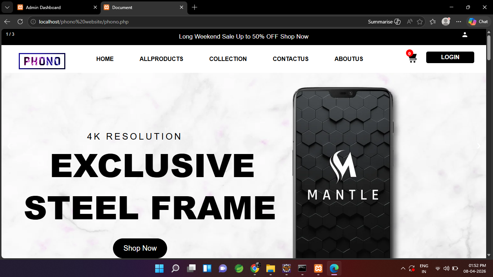
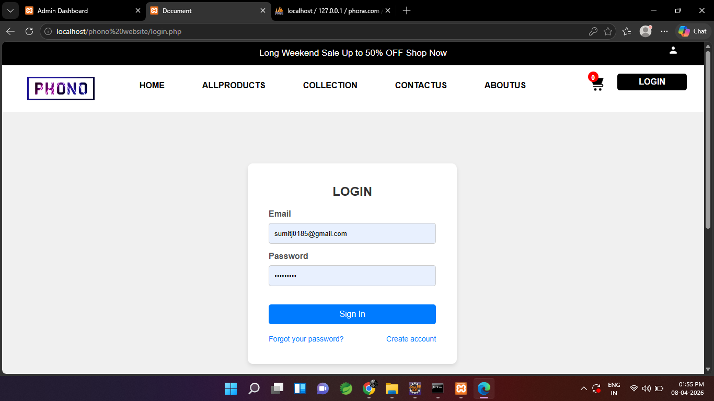
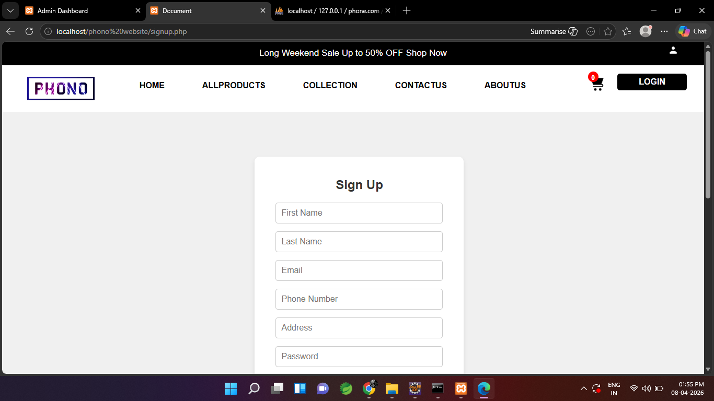
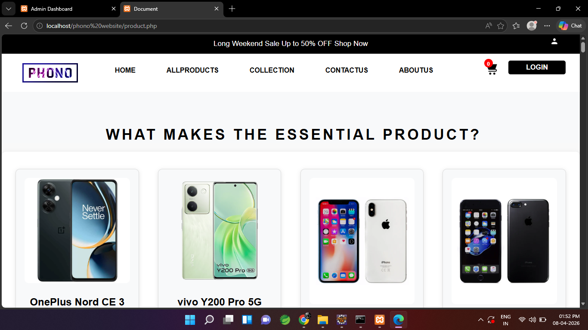
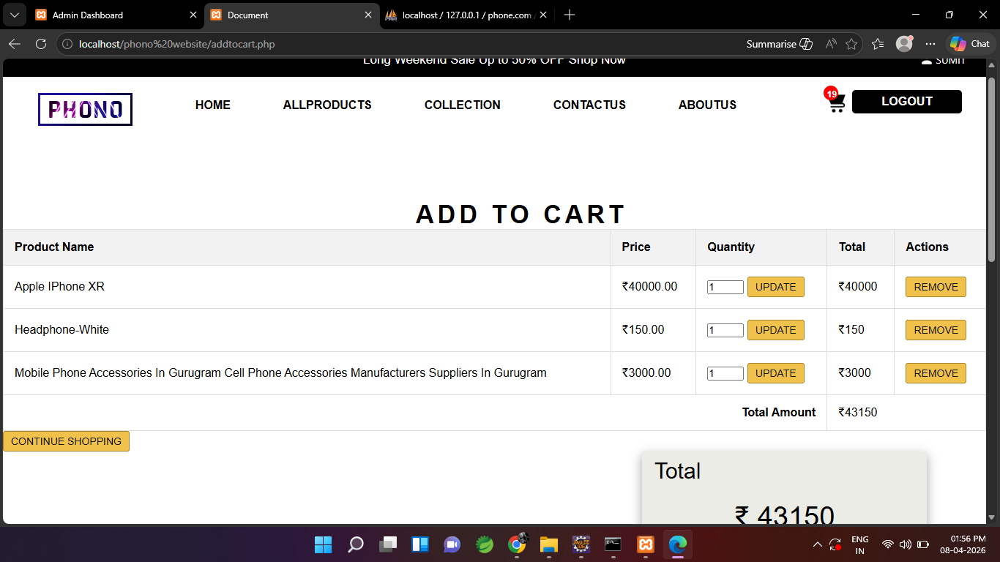
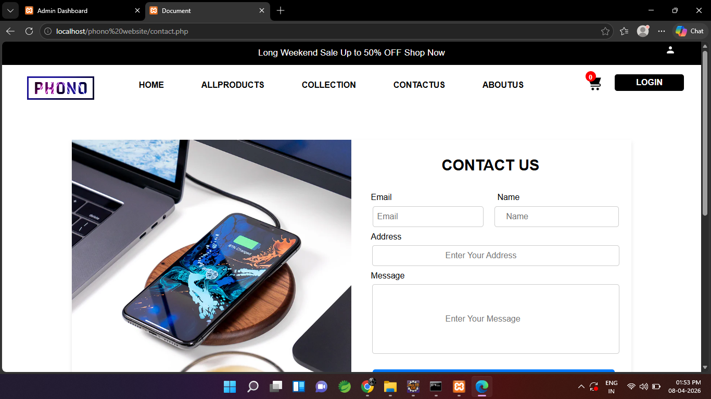
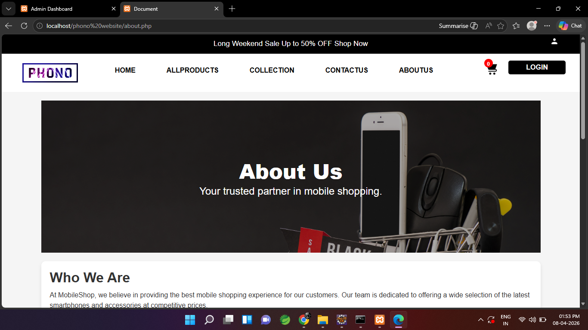
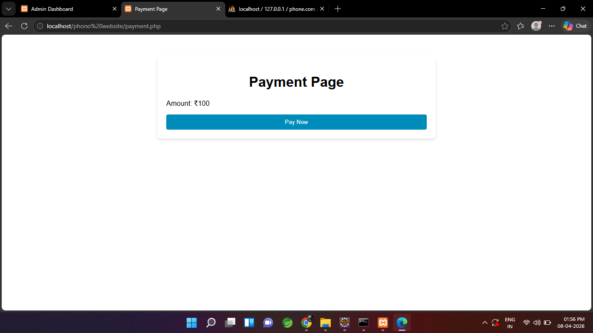
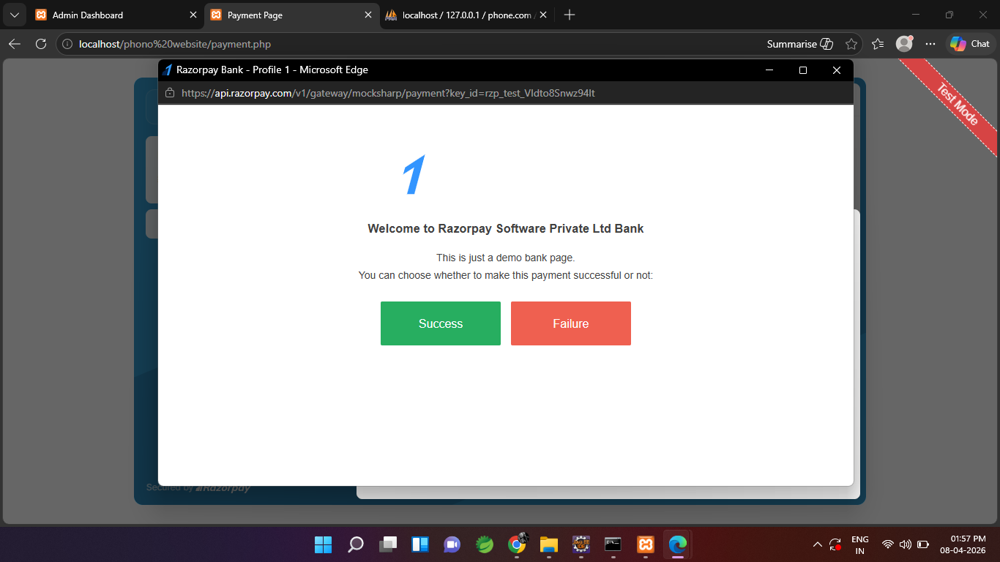

# 📱 Phone Shopping Website

## 📌 Project Description

This is a dynamic Phone Shopping Website developed using PHP and MySQL. The platform allows users to browse mobile products, filter them by collections, and add items to the cart for purchase. It also includes a fully functional admin panel to manage products, orders, customers, and contact messages.

---

## 🚀 Features

### 👤 User Module

* Home Page
* User Registration & Login
* View All Products
* Filter Products by Collection
* Add to Cart
* Contact Page
* About Page

### 🛠️ Admin Module

* Admin Login
* Add New Products
* Manage Products
* View Orders
* Manage Customers
* View Contact Queries
* Recent Products Section
* Logout

---

## 🛠️ Technologies Used

* PHP
* MySQL
* HTML
* CSS
* Bootstrap
* JavaScript

---

## 📂 Project Structure

/project-folder
│── /admin
│── /assets
│── /config
│── /includes
│── /screenshots
│── index.php
│── login.php
│── register.php
│── cart.php

---

## 📸 Screenshots

---

## ⚙️ Setup Instructions

1. Clone the repository
   git clone https://github.com/your-username/your-repo-name.git

2. Move the project to XAMPP htdocs folder

3. Start Apache and MySQL from XAMPP

4. Import the database file into phpMyAdmin

5. Run the project in browser
   http://localhost/project-folder

---

## 📬 Contact

For any queries or suggestions, feel free to contact.

---

## ⭐ Author

**Sumit Avinash Jadhav**
